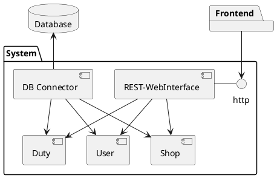

# Floor Management System
This is going to be a open source project, about a managemnt system for an residential community.

## Starting Point
This is a learning project for myself, to learn to write an applitaion with "clean architecture" and rust.

## Linked Projects
[Frontend](https://github.com/niladi/floor-managment-vue)

## Principals
To throw some bustwords: 
 * Clean Architecture, Clean Code after Rob C. Martin "Uncle Bob"
 * Domain Driven Design

## Structure
